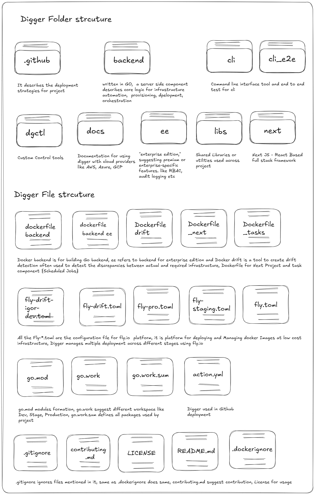
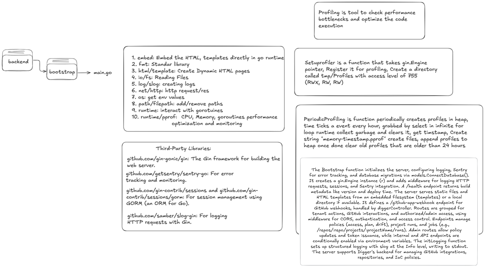
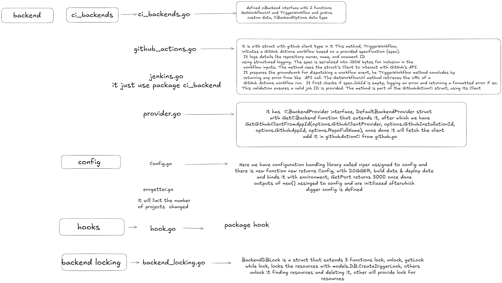

# All About Digger

The image illustrates the folder structure of the Digger project, an IaC orchestration tool.  
It includes top-level folders like `.github`, `backend`, `cli`, and `cli_e2e`.  
Other directories such as `dgtl`, `docs`, `ee`, `libs`, and `next` are shown.  
Docker-related files include `dockerfile.backend`, `dockerfile.ee_drift`, and `dockerfile_next`.  
Configuration files for Fly.io (`fly-drift-igor-dev.toml`, `fly-pro.toml`) are listed.  
Go-specific files like `go.mod`, `go.work`, and `go.work.sum` are present.  
Additional files include `action.yml`, `.gitignore`, `contributing.md`, `LICENSE`, and `README.md`.  
The structure supports Digger’s backend, CLI, and deployment workflows.  

# Here we start with the deep dive into digger project

# Digger Backend Architecture Overview

The backend directory interacts with `main.go` through the `Bootstrap` function. A 10-step optimization checklist includes embedding HTML templates, leveraging standard libraries, and profiling with `runtime/pprof`. Third-party libraries used are `gin` for the web server, `sentry` for error tracking, `sessions` for session management, and `slog` for logging. Profiling tools like `Setuprofiler` and `PeriodicProfiling` are emphasized for performance monitoring. The `Bootstrap` function initializes the server, configuring logging, error tracking, and middleware. It creates a `gin.Engine` instance and sets up routes for GitHub webhooks and API endpoints. Middleware manages CORS, authentication, 

The image outlines the Digger project's backend structure within the `backend` directory.  
It highlights `ci_backends` with `ci_backends.go`, defining the `CIBackend` interface for GitHub workflows.  
`github_actions.go` implements `TriggerWorkflow` using `GithubActions` struct and `spec` for JSON serialization.  
`jenkins.go` uses the `CIBackend` package for Jenkins workflow triggers.  
`provider.go` defines `CIBackendProvider` for dynamic GitHub client retrieval.  
`config` uses `viper` in `config.go` to manage settings like `DIGGER_BUILD_DATE`.  
`envgetter.go` limits project changes, while `hooks` and `backend_locking` handle webhooks and resource locking.  
`backend_locking.go` defines `BackendDBLock` for managing resource locks with database operations.  

## Summary
- **Keywords**: Backend, CIBackend, GitHub, Jenkins, Viper, Locking, Webhooks